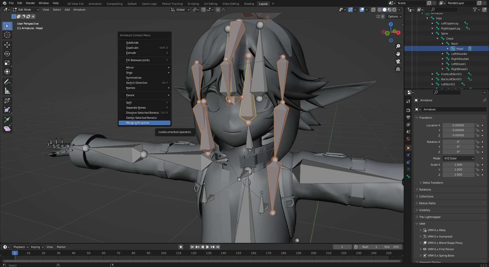
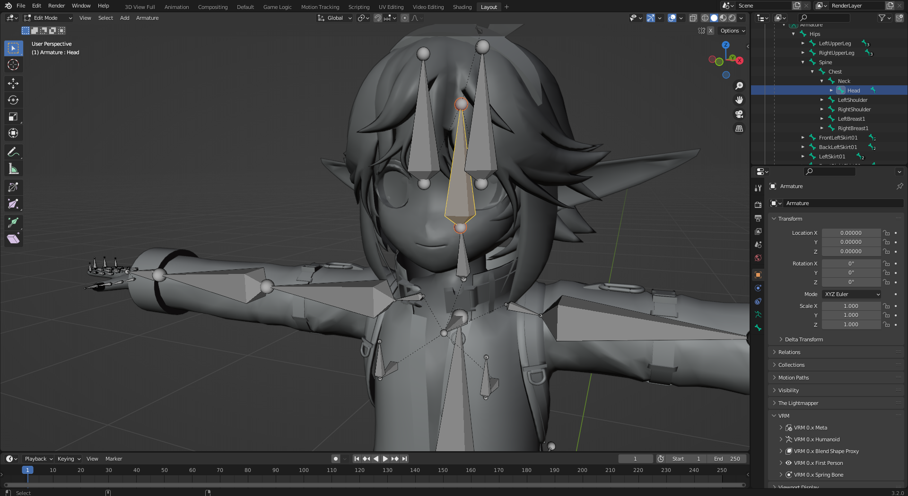
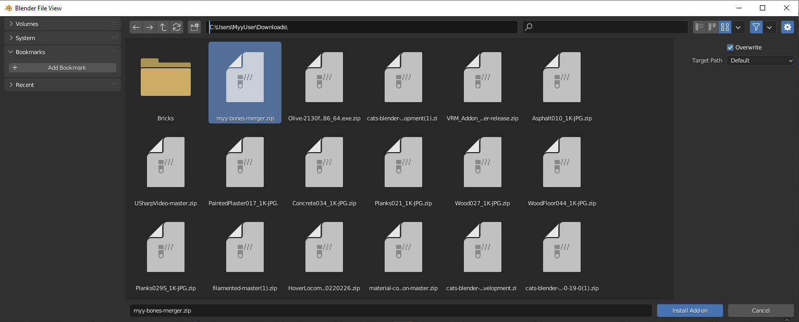
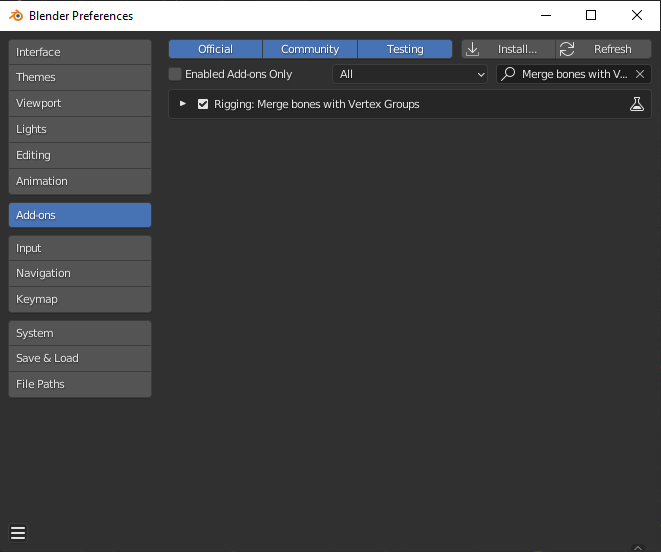

# About

This tool add an option to the Armature "Edit Mode" context menu, in order
to merge bones **and** their respective weight paint in one operation.

I mainly use this to clean up unused bones on 3D avatars for VRChat.

# Screenshots

**Invoking the menu**

**Results afterward**

**Testing in Pose mode**

*Model in the photo : [RRRR by 広い部屋](https://booth.pm/ja/items/2019040)*

The tool will add a 'Merge with active' option to the Bones Context menu
when **Edit**ing an Armature.  
This option will merge all the selected bones with the current active one,
as long as the active one has an appropriate vertex group associated.  
When merging, all the weights (weight paint) associated to the removed
bones vertex groups will be added to the vertex group of the remaining bone.  
Meaning that the remaining bone will accumulate all the weight paint information
of the removed bones.

# Installation

* Download the latest release Zip file.
* Open Blender
* Open the Preferences panel (Edit > Preferences)  

* Select Add-on in the left pane of this panel  
* On the upper-right of this panel, click on 'Install...'

* Select the downloaded Zip file

* Check the 'Rigging: Merge bones with Vertex Groups' checkbox

Now the Add-on is ready to be used

# Usage

* Select the Armature
* Tab into 'Edit Mode'
* Select all the bones you want to merge and remove
* Select the destination bone last, so it becomes active.  
  This one will remain after the merging process.
* Right-click and select 'Merge with active'

# But can't you already merge bones in Blender ?

You can merge bones in Blender using "Dissolve Bones".  
However, dissolving will completley ignore the vertex groups associated to
the removed bones. Meaning that, when using Dissolve, the remaining bone
weight paint will stay the same, and will certainly NOT contain the weight
paint of the removed bones.  
This leads to that predictable 3D rigging disaster with overstretched vertices
due to some other vertices not moving at all when rotating the bones.

My tool takes care of merging the vertex groups, meaning that the remaining bone
vertex group will accumulate all the weight painting information of the removed
bones.  
THIS being the main reason why I made this tool actually.

Note that, after merging the bones, this tool also remove the previous vertex
groups associated to the removed bones.

# Why does the merged bone size remains the same ?

As you can see in the screenshot, most of the time, the bones merged are all
over the place. In such situations, changing the bone size would just lead
to oversized bones that just hinders the editing process.  
If you want to change the size of the bones, you'll have to do it manually,
ever before or after using "Merge bones with active".