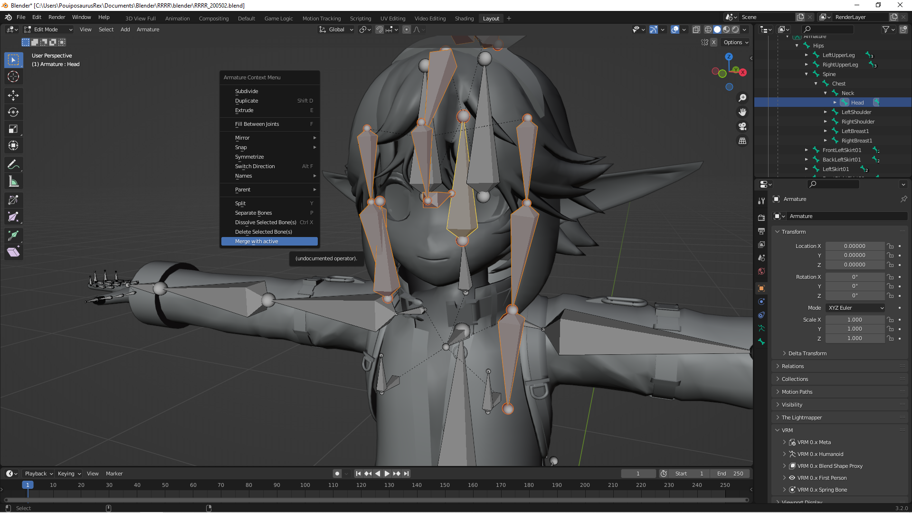
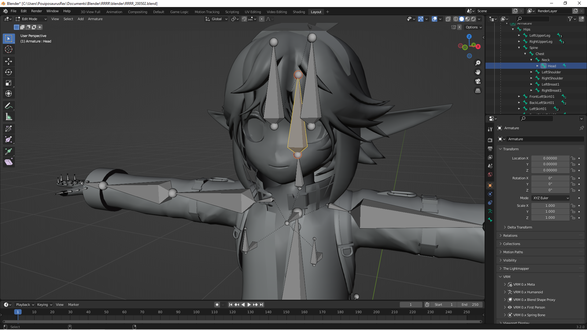
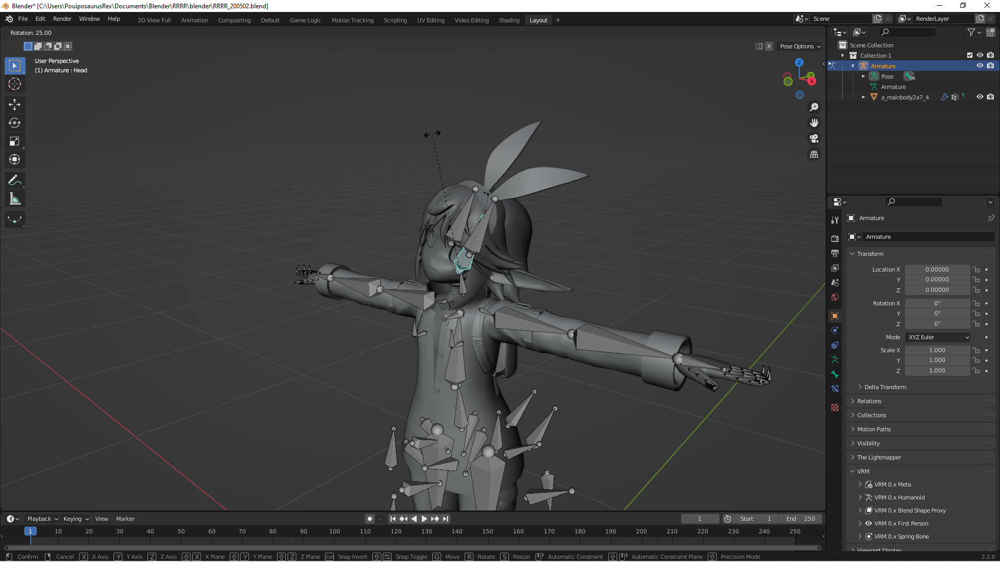

# About

This plugin add the ability to merge bones **and** their respective vertex groups
at the same time.

I mainly use this to clean up unused bones on 3D avatars for VRChat.

# Screenshots

**Invoking the menu**

**Results afterward**

**Testing in Pose mode**

*Model in the photo : [RRRR by 広い部屋](https://booth.pm/ja/items/2019040)*

The tool will add a 'Merge with active' option to the Bones Context menu
in when **Edit**ing an Armature.  
This option will merge all the selected bones with the current active one,
as long as the active one has an appropriate vertex group associated.  
All the weights of the exiting vertex groups associated with the bones removed
during the merge will be added to the vertex group of the remaining bone.

# Usage

* Select the Armature
* Tab into 'Edit Mode'
* Select all the bones you want to merge and remove
* Select the destination bone last, so it becomes active.  
  This one will remain after the merging process.
* Right-click and select 'Merge with active'

# But can't you already merge bones in Blender ?

You can merge bones in Blender. However, the internal merge function completely
ignore the vertex groups associated with these bones.  
Meaning that, when using the internal method, moving the remaining bone will only
the vertices associated with its vertex group. The vertices associated with the
vertex groups of the removed bones will stay in place, however, leading to a far
too common 3D rigging disaster.

My tool takes care of merging the vertex groups, meaning that moving the bone
will also move all the vertices associated with the vertex groups of the merged
bones.  
Once merged with the remaining bones, the vertex groups of the deleted bones
are deleted too.

# Why does the merged bone size remains the same ?

As you can see in the screenshot, most of the time, the bones merged are all
over the place. In such situations, changing the bone size would just lead
to oversized bones that just hinders the editing process.